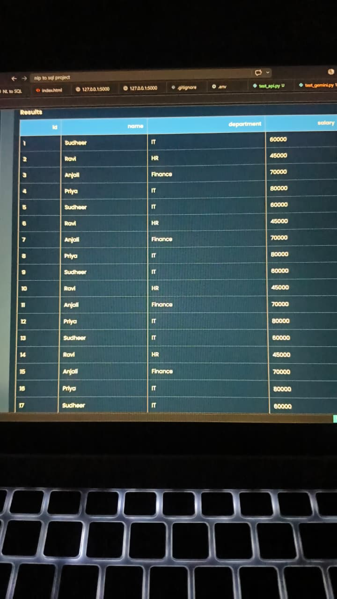
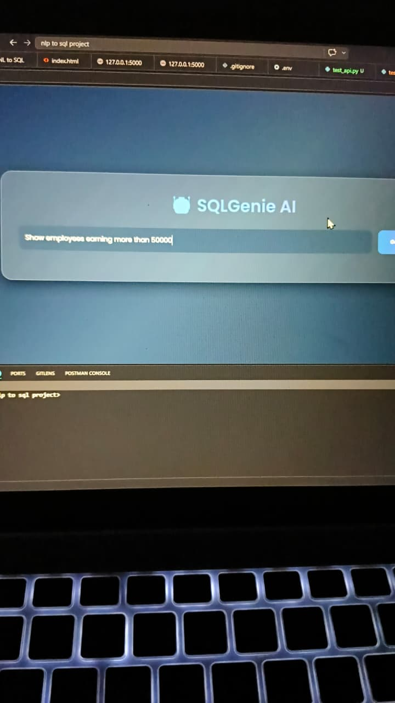
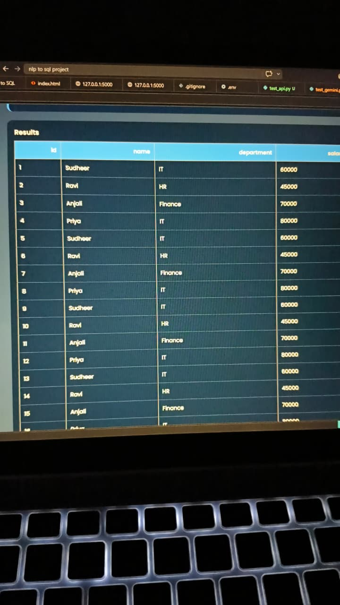

# NLP-to-SQL AI

An AI-powered web application that converts natural language questions into SQL queries and executes them on a database.

## Features

* Convert English questions into SQL queries
* Execute generated SQL on SQLite database
* Display query results in a user-friendly interface
* Modern responsive UI built with Flask
* Supports filtering, sorting, and aggregation queries

## Tech Stack

* Python
* Flask
* SQLite
* Pandas
* HTML, CSS, JavaScript

## Project Structure

```text
nlp-to-sql-ai/
│
├── app.py
├── db.py
├── sample_data.py
├── sql_generator.py
├── requirements.txt
├── templates/
├── static/
└── README.md
```

## Installation

```bash
pip install -r requirements.txt
```

## Run the Project

```bash
python db.py
python sample_data.py
python app.py
```


## Output Screenshots

### Screenshot 1


### Screenshot 2


### Screenshot 3


### Screenshot 4


## Live demo link 
https://nlp-to-sql-ai-8os3.onrender.com/

## Example Questions

* Show all employees
* List employees in the IT department
* Show employees earning more than 50000
* What is the average salary?
* Count employees in each department


## Author

Sudheer
